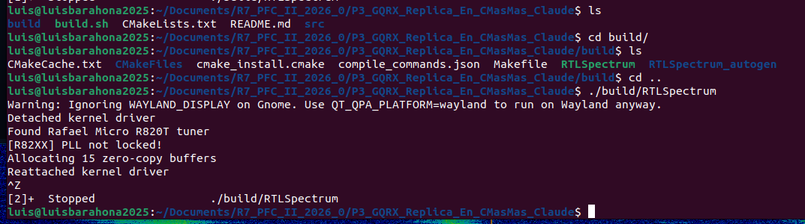
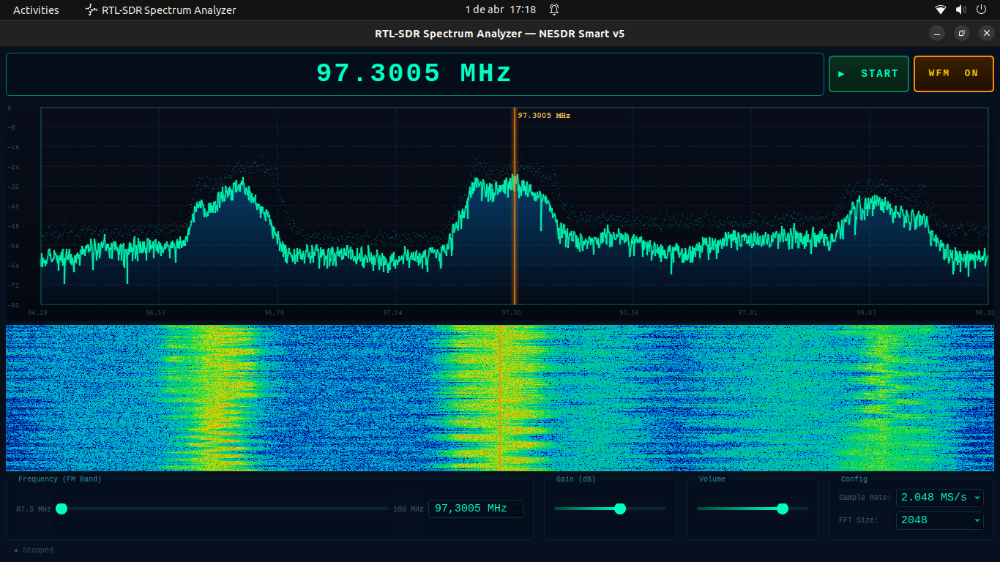

# 📡 RTL-SDR Spectrum Analyzer

Analizador de espectro completo con cascada (waterfall), demodulador WFM mono y sintonizador interactivo.
Diseñado para el **Nooelec NESDR Smart v5** en Ubuntu 22.04.

---

## Características

| Feature | Detalle |
|---|---|
| **Espectro FFT** | Visualización en dBFS con average exponencial + peak hold |
| **Waterfall** | Cascada con colormap térmico (negro→azul→cyan→verde→rojo) |
| **Demodulador WFM** | FM de banda ancha mono, activable con botón |
| **Sintonizador** | Slider FM (87.5–108 MHz), SpinBox (0.1–1750 MHz), clic en espectro |
| **FFT configurable** | 512, 1024, 2048, 4096, 8192 puntos |
| **Sample rates** | 1.024, 2.048, 2.4, 3.2 MS/s |
| **Gain control** | Slider de ganancia del tuner |
| **Volumen** | Control de volumen del audio |
| **Audio ALSA** | Salida de audio PCM 48 kHz via ALSA |

---

## Requisitos

```
librtlsdr-dev
libfftw3-dev
qt6-base-dev
libasound2-dev
cmake >= 3.16
```

---

## Compilación

```bash
chmod +x build.sh
./build.sh
```

O manualmente:

```bash
mkdir build && cd build
cmake .. -DCMAKE_BUILD_TYPE=Release
make -j$(nproc)
```

---

## Ejecución

```bash
./build/RTLSpectrum
```


Si aparece error de permisos USB:
```bash
sudo adduser $USER plugdev
# O simplemente:
sudo ./build/RTLSpectrum
```

---

## Uso

1. **Conectar** el NESDR Smart v5 al USB
2. Presionar **▶ START** — el dispositivo se abre y empieza el streaming
3. **Sintonizar**:
   - Arrastra el slider de frecuencia (banda FM por defecto)
   - Escribe en el SpinBox cualquier frecuencia entre 0.1 y 1750 MHz
   - Haz clic directamente en el espectro o waterfall
4. **WFM**: Activa el botón **WFM ON** para escuchar la emisora sintonizada
5. Ajustar **Gain** y **Volume** según necesidad
6. Cambiar **Sample Rate** y **FFT Size** en el combo box

---

## Arquitectura

```
main.cpp
├── MainWindow          — UI Qt6, coordinador principal
│   ├── SpectrumWidget  — Pintura FFT (QPainter, custom rendering)
│   ├── WaterfallWidget — Cascada scrolling (QImage pixel manipulation)
│   ├── RTLWorker       — Thread RTL-SDR (rtlsdr_read_async + FFTW3)
│   ├── DemodWFM        — Demodulador FM (atan2 discriminator + FIR + de-emphasis)
│   └── AudioOutput     — Thread ALSA (snd_pcm_writei)
```

### Pipeline de señal WFM

```
RTL-SDR (uint8 IQ)
  → conversión [-1,1] complex float
  → FM discriminator: arg(x[n] * conj(x[n-1]))
  → Low-pass FIR (80 kHz cutoff)
  → Decimación stage 1 (÷8, →256 kHz)
  → Decimación stage 2 (÷6, →~42 kHz)
  → De-emphasis tau=75μs
  → ALSA PCM 48 kHz 16-bit mono
```

---

## Notas técnicas

- El worker usa **rtlsdr_read_async** en su propio QThread
- La FFT usa ventana **Hann** y shift de DC al centro
- El waterfall hace **scroll por memmove** sobre un QImage en RAM (no GPU)
- El demodulador usa **atan2 discriminator** clásico (más estable que diferencial complejo)
- ALSA usa buffer circular con **dequeue** thread-safe para evitar underruns

---

## Rangos del NESDR Smart v5

| Parámetro | Rango |
|---|---|
| Frecuencia | 100 kHz – 1.75 GHz |
| Ancho de banda | hasta 3.2 MS/s |
| ADC | 8 bits |
| Oscilador | TCXO ±0.5 ppm |

---
## Validación de Funcionamiento 
Se sintonizará la radio FM Moda (97.3MHz)

